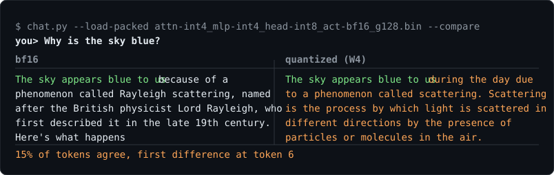

<h1 align="center">llm-quant</h1>

<p align="center">
  <b>Symmetric RTN quantization for Llama-class models, with CUDA kernels and a pipeline
  that checks its own predictions.</b>
</p>

<p align="center">
  <a href="https://www.apache.org/licenses/LICENSE-2.0"></a>
  
  
</p>

<p align="center">
  
</p>

<p align="center">
  <sub><code>chat.py --compare</code> puts the quantized model next to the bf16 one and shows where they part.
  Greedy decoding on both, so every difference is quantization error.</sub>
</p>

Weights go to int4 or int8 in groups of 128 along the reduction axis; activations and the
KV cache are separate choices. There is no calibration step — RTN only — so a configuration
is a few dtypes and nothing has to be fit.

The quantizer is standard. What this repo is actually about is the path from "quantize it"
to "and it is measurably faster", because that path is where the interesting failures are,
and most of them only show up when you measure rather than reason. Several are written down
here with the numbers that produced them.

## Quickstart

```bash
python -m pip install -e ".[dev]"   # ninja is required: the CUDA kernels JIT-compile
```

```bash
# one configuration, measured
python examples/run.py --cfg configs/recommended.yaml

# pack it, then talk to it
python examples/run.py --cfg configs/recommended.yaml --mode kernel --pack
python examples/chat.py --load-packed experiments/llama3.2-1b-recommended/model.bin
```

```python
from llmquant import QuantConfig, oneshot
from llmquant.core.config import ModelArgs
from llmquant.core.model import load_pretrained

model, tokenizer = load_pretrained(ModelArgs())
oneshot(model, QuantConfig(attn_weight="int8", mlp_weight="int8").to_modifier(mode="kernel"))
```

Or run the whole study — structure check, sweep, selection, and a re-measurement of the
winner on the real path — with one command:

```bash
python examples/sweep.py --cfg configs/sweep.yaml
python examples/sweep.py --cfg configs/smoke.yaml    # two-minute plumbing check
```

Python ≥ 3.10 and PyTorch with CUDA. Kernels compile on first use (1–2 minutes, then
cached). Built and measured on an RTX 5060 Ti (sm_120) under Windows; [NOTES.md](NOTES.md)
has the MSVC/nvcc setup, including the one where `nvcc` dies silently because `%TMP%`
contains a space.

## Results (Llama-3.2-1B-Instruct, group 128)

Accuracy is mean score over ARC-Easy, ARC-Challenge and OpenBookQA — generation tasks, not
perplexity, for reasons below. Speed is measured on `mode=kernel`.

| configuration | accuracy | Δacc | decode | TTFT | peak VRAM | BPV |
|---|---|---|---|---|---|---|
| bf16 | 0.4867 | — | 77.3 tok/s | 48.6 ms | 2.42 GB | 16.00 |
| W8 + int8 lm_head | 0.4700 | −3.43% | **80.6 tok/s** | 79.8 ms | 1.91 GB | 9.33 |
| W8, bf16 lm_head | 0.4722 | −2.97% | 74.3 tok/s | 80.8 ms | 1.65 GB | 10.98 |

3 of 25 combinations came within a 5% accuracy limit, and all three were int8 weights.

Where the accuracy goes, one axis at a time:

```
attn_weight: int8 -> int4    +30.08%    dBPV -1.09
kv_cache:    bf16 -> int4    +23.23%    dBPV  0.00
mlp_weight:  int8 -> int4    +13.38%    dBPV -2.61
kv_cache:    bf16 -> int8     +1.28%    dBPV  0.00
activation:  bf16 -> int8     +0.97%    dBPV  0.00
```

### Five things that were not obvious

**Perplexity is wrong in both directions.** A PPL pass never reads the KV cache back, so it
scores an int4 cache at +0.18% while generation accuracy falls 18%. In the other direction
it overstates int4 weight damage by 33 points. Accuracy here is measured on generations.

**int4 belongs in the MLP, never in attention.** Attention is 2.2x more int4-sensitive and
saves 2.4x less, so `attn=int8, mlp=int4` beats `attn=int4, mlp=int8` on accuracy *and*
size. An earlier PPL-based reading of the same question said the opposite.

**An int8 KV cache is not free, and the analytic model cannot see why.** It was projected at
1.47x decode and measured 0.65x: on a 1B model at 2k context the weights are 1.58 GB per
token against a 0.034 GB cache, so quantizing the cache saves 1.8% of the traffic — and
costs 32% of decode time, because it runs in PyTorch on every step while the weights are
read by a kernel. This is what stage 4 exists to catch.

**An int8 activation buys nothing here, and cannot.** No mode in this repo runs an
int8xint8 matmul: `fake` quantize-dequantizes and then multiplies in bf16, `real` quantizes
to integers and multiplies in fp32 for exactness, and `kernel` is weight-only -- it reads
the activation scheme only to print a label. Building an int GEMM would not change the
answer either: `torch._int_mm` measured 1.03-1.04x against bf16 on this GPU and requires
M>16, so decode cannot call it at all. And decode would not benefit in any case, because at
M=1 the matmul is a GEMV that streams the whole weight matrix to do very little arithmetic
-- the activation is a few KB against 1.6 GB of weights per token. Shrinking the small
operand does nothing when the large one is the bottleneck, which is why the activation axis
moves BPV and decode traffic by exactly 0.00.

**Quantizing the transformer weights does not speed up decode at this size.** Only ~45% of a
decode step is weight bandwidth on a 1B model, so halving the weight bytes cannot pay for
the dequant on the way in. What puts the stack above baseline is `head_weight=int8`, and it
reads oddly on disk: this model ties `lm_head` to the embedding, so quantizing it does not
shrink a tensor — it unties one and adds a 258 MB int8 copy beside the 501 MB bf16
embedding. Decode does not care, because it reads `lm_head` in full every token and only
row-indexes the embedding. Hence disk +252 MB and decode traffic −237 MB/token at once.
Stage 1 prints this before the sweep runs, so the next model does not repeat the confusion.

## Documentation

| | |
|---|---|
| [Usage](docs/usage.md) | the five stages end to end, and what each script is for |
| [Configuration](docs/configuration.md) | the dtype axes, the three modes, sweep grids |
| [Supported models](docs/models.md) | which architectures are reached, and Mixture-of-Experts |
| [Internals](docs/internals.md) | layout rules, bit-exactness, and what was rejected |
| [NOTES.md](NOTES.md) | the working notes, in Korean, far more detailed than any of this |

## Tests

```bash
python -m pytest -q
```

GPU tests skip automatically without CUDA.

## Contributing

[CONTRIBUTING.md](CONTRIBUTING.md) has the setup, the checks to run, and the one rule that
matters here: a performance claim needs the measurement that produced it, and a measurement
needs to be repeated before it is believed. Several conclusions in this repo were wrong the
first time because a single run landed inside the run-to-run spread.

## License

Apache 2.0. See [LICENSE](LICENSE).
